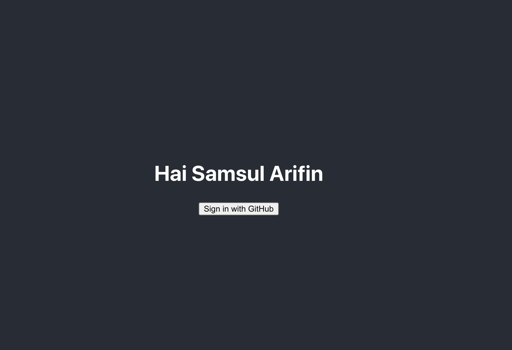

## Expected

## Build Setup

1. clone this project use : git clone https://github.com/afsori/web-debugging.git

2. install depedencies : npm install or yarn install

## Debugging

1. Pertama jalankan npm install

2. Kemudian mulai debug, dengan melihat expected : Menampilkan nama github yang login di halaman web

3. kemudian saya lihat di folder src/App.js . ternyata useState belum diberi nilai default, dan saya hanya menambahkan nama "Samsul Arifin" di useSTATE nya.